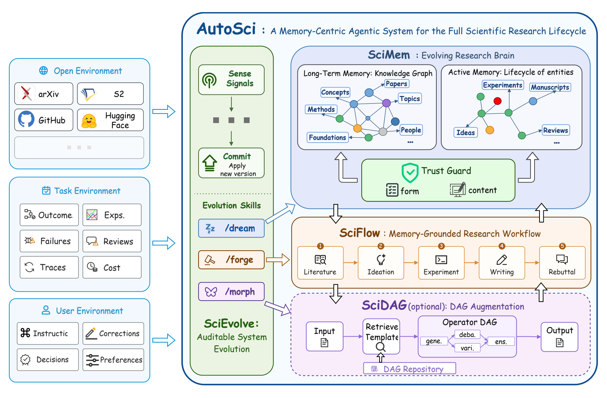

<div align="center">


# AutoSci-Qoder

**读文献、想点子、跑实验、写论文、持续进化 —— 面向 Qoder 的 AI 科研智能体，记忆跨项目复利积累。**

[](LICENSE)
[](https://www.python.org/)
[](https://qoder.com)
[](https://arxiv.org/abs/2605.31468)

</div>

---

## 项目简介

本仓库是 [AutoSci](https://github.com/skyllwt/AutoSci)（上游稳定版基于 Claude Code）的 **Qoder 适配版**。AutoSci 是一个以记忆为中心的科研智能体系统，覆盖从文献消化到 rebuttal 的完整科研生命周期，并在项目之间保持结构化持久记忆。

适配原则：**不改动上游的科研逻辑**。全部 28 个 skill、Python 工具链（`tools/`）、wiki 契约（`runtime/`）保持原样，仅将运行时载体从 Claude Code 替换为 Qoder：

| 上游（Claude Code） | 本仓库（Qoder） |
|---|---|
| `.claude/skills/` | `.qoder/skills/`（由 `tools/convert_to_qoder.py` 自动生成） |
| `CLAUDE.md` 运行时契约 | `AGENTS.md`（Qoder 自动读取） |
| `.mcp.json` | `.qoder/mcp.json`（llm-review MCP server） |
| `/setup`、`/init` 等斜杠命令 | 按 skill 名称调用（如让 Qoder 运行 `init` skill） |
| Claude Code 子代理并行 ingest | Qoder 子代理（Agent 工具）+ 同一套 git worktree 隔离契约 |

> 📄 论文：[AutoSci: A Memory-Centric Agentic System for the Full Scientific Research Lifecycle](https://arxiv.org/abs/2605.31468)。若本系统对你的研究有帮助，请[引用论文](#引用)。

<div align="center">

</div>

---

## 🚀 快速安装

**前置要求：** Python 3.9+（推荐 3.10+，DeepXiv 功能需要）、git、[Qoder](https://qoder.com)。

### Windows（PowerShell）

```powershell
# 1. 克隆本仓库
git clone https://github.com/terryji-lab/AutoSci-Qoder.git
cd AutoSci-Qoder

# 2. 一键安装（中文 skills；英文用 -Lang en）
powershell -ExecutionPolicy Bypass -File .\setup-qoder.ps1 -Lang zh
```

脚本会自动完成：Python 环境检查 → 创建 `.venv` 并安装依赖 → 从模板生成 `.env` → 将 `i18n/zh/skills` 转换为 Qoder 原生 `.qoder/skills`（28 个 skill）→ 生成根目录 `AGENTS.md` 与 `.qoder/mcp.json` → 逐项验证安装。

### Linux / macOS

```bash
git clone https://github.com/terryji-lab/AutoSci-Qoder.git
cd AutoSci-Qoder
chmod +x setup-qoder.sh && ./setup-qoder.sh --lang zh
```

---

## ⚙️ 安装后配置

### 1. 用 Qoder 打开项目

直接用 Qoder 打开项目根目录。根目录的 `AGENTS.md`（运行时契约）和 `.qoder/skills/`（项目级 skills）会被自动加载。

### 2. 注册 llm-review MCP server（可选但推荐）

`/review`、`/rebuttal`、`/novelty` 等跨模型评审功能依赖本地 `llm-review` MCP server。安装脚本已生成 `.qoder/mcp.json`（来自 `config/mcp.qoder.json.example`）：

```json
{
  "mcpServers": {
    "llm-review": {
      "command": ".venv/Scripts/python.exe",
      "args": ["mcp-servers/llm-review/server.py"],
      "cwd": "${workspaceFolder}"
    }
  }
}
```

若 Qoder 未自动识别该文件，请在 Qoder 的 MCP 设置中手动添加（Linux/macOS 把 command 改为 `.venv/bin/python`）。不配置也能用，相关 skill 会降级为单模型自审模式。

### 3. 配置 API key

在 Qoder 中让它运行 **`setup` skill**，会交互式引导你配置（全部可选，可随时重跑补充）：

| Key | 建议 | 作用 |
|-----|------|------|
| `SEMANTIC_SCHOLAR_API_KEY` | **推荐**（免费） | 引用图谱与论文检索；不配置时 `/init` 速度慢约 3 倍 |
| `DEEPXIV_TOKEN` | 可选 | 语义检索、TLDR 摘要、热门论文检测（可在 setup 中一键自动注册） |
| `LLM_API_KEY` + `LLM_BASE_URL` + `LLM_MODEL` | 可选 | 跨模型独立评审（任何 OpenAI 兼容 API：DeepSeek、OpenAI、Qwen、OpenRouter、SiliconFlow 等） |

> Qoder 自身的模型与登录由 Qoder 管理，不需要额外的 agent runtime key。

### 4. 放入你的素材（可选）

- `raw/papers/` — 你自己的论文（`.tex` 或 `.pdf`）
- `raw/notes/` — 研究意图笔记
- `raw/web/` — 网页存档

---

## 🧭 使用流程

在 Qoder 对话框中**按名称调用 skill** 即可（文档中的 `/init`、`/ingest` 等写法均表示"调用 skill `init`"）。典型科研流程：

```text
1. setup       — 配置 API key（一次性）
2. init <研究主题>  — 消化你的论文 + 自动发现 8-10 篇相关文献，构建 wiki 知识库
3. ask / check — 向知识库提问 / 体检
4. ideate      — 生成并筛选研究点子（含预实验试点）
5. exp-design → exp-run → exp-eval — 实验设计、执行、裁决
6. paper-plan → paper-draft → paper-compile — 论文大纲、起草、编译 PDF
7. review / rebuttal / poster — 评审、答辩、学术海报
```

日常补充文献：`ingest`（单篇，本地路径或 arXiv 链接）、`discover`（候选清单）、`daily-arxiv`（每日推荐）。

<details>
<summary><b>全部 28 个 skill 一览</b></summary>

### 阶段 0：配置
| Skill | 作用 |
|-------|------|
| setup | 交互式 API key 配置引导（Semantic Scholar、DeepXiv、Review LLM） |
| reset | 按范围（`wiki / raw / log / checkpoints / all`）重置 wiki 状态 |

### 阶段 1：知识库
| Skill | 作用 |
|-------|------|
| prefill | 预填充领域基础知识，避免后续 ingest 重复创建教科书概念页 |
| init | 从 `raw/` 素材引导构建 wiki，可选外部发现，并行消化最终论文集 |
| ingest | 消化一篇论文（本地路径或 arXiv URL），建立全部交叉引用与图边 |
| discover | 构建候选论文排序清单（锚点/主题/会议/w 状态驱动），不入库 |
| edit | 按用户请求增删原始素材或更新 wiki 内容 |
| ask | 向 wiki 提问，综合检索相关页面作答，好答案可沉淀回 wiki |
| check | 全库健康扫描，生成分级修复建议报告 |

### 阶段 2：创意与实验
| Skill | 作用 |
|-------|------|
| daily-arxiv | 每日 arXiv 推荐（一次性或定时），邮件推送排序摘要，可选自动入库 |
| ideate | 多阶段点子生成：领域扫描 → 双模型头脑风暴 → 过滤验证 → 写入 wiki → 试点 |
| exp-pilot-run | 预实验执行：写代码、部署、监控、收集原始结果 |
| exp-pilot-eval | 预实验评估：读取结果、应用宽松判定、更新 idea 页面 |
| novelty | 多源新颖性验证（WebSearch + Semantic Scholar + wiki + Review LLM） |
| review | 对任意研究产出做跨模型评审，输出结构化评分与改进建议 |
| exp-design | idea 驱动的实验设计：方法候选 → 基准选择 → 敏感性分析 → 主实验 |
| exp-run | 完整实验执行流水线：准备代码 → 部署 → 监控 → 收集结果 |
| exp-status | 查看所有在跑实验状态，可选自动收集并推进流水线 |
| exp-eval | 实验裁决关卡：Review LLM 独立判定结果并更新 idea 状态与图边 |
| refine | 多轮迭代打磨产出：评审 → 解析反馈 → 修复 → 更新 wiki，直到目标分数 |

### 阶段 3：写作与传播
| Skill | 作用 |
|-------|------|
| survey | 基于 wiki 生成 Related Work：主题分组 → 叙事结构 → LaTeX 输出 |
| paper-plan | 从 idea 图谱整理论文大纲：证据地图 → 叙事结构 → 章节/图表/引用计划 |
| paper-draft | 按大纲起草 LaTeX 论文：逐节写作、生成图表、校验 BibTeX |
| paper-compile | LaTeX 编译 → PDF：自动修复 + 页数/匿名/字体检查 + 投稿清单 |
| research | 端到端科研编排：idea 发现 → 实验 → 裁决 → 写作（含人工关卡） |
| rebuttal | 解析评审意见 → 原子化 → 映射 wiki → Review LLM 压力测试 → 生成 rebuttal |
| poster | 从已起草论文生成学术海报（单页 HTML + 印刷级 PNG） |

### 工具
| Skill | 作用 |
|-------|------|
| visualize | 生成 Obsidian 图配置与 Canvas 知识地图；交互式网页图由 `tools/serve.py` 提供（`python tools/serve.py` 后访问 `http://localhost:8765/#/graph`） |

</details>

---

## 🗂️ 目录结构与适配机制

```text
.qoder/skills/        ← Qoder 原生 skills（生成物，勿手改）
AGENTS.md             ← 运行时契约（生成物，勿手改）
i18n/{en,zh}/         ← 双语 skill 源（唯一事实来源）
tools/convert_to_qoder.py ← i18n → .qoder 的确定性转换器
setup-qoder.ps1 / .sh     ← Qoder 一键安装脚本
runtime/              ← wiki 契约源（schema + policy + templates）
tools/                ← Python 工具（research_wiki.py 是 wiki 引擎）
mcp-servers/llm-review/   ← 跨模型评审 MCP server
wiki/ raw/            ← 你的知识库与素材（本地生成，不入库）
```

修改 skill 内容的正确方式：编辑 `i18n/<lang>/skills/` 下的源文件，然后重新运行安装脚本或 `python tools/convert_to_qoder.py --lang zh` 重新生成。

---

## 🔄 同步上游更新

```powershell
git remote add upstream https://github.com/skyllwt/AutoSci.git
git fetch upstream
git merge upstream/main        # 或 rebase；冲突后重跑转换脚本
python tools/convert_to_qoder.py --lang zh
```

---

## 常见问题

- **Windows 远程 GPU 实验**：`exp-run --env remote` 依赖 `ssh`/`rsync`/`screen`，建议在 WSL2 或 Linux/macOS 上运行；本地流水线原生支持 Windows。
- **切换语言**：重新运行 `setup-qoder.ps1 -Lang en`（或 `--lang zh`）即可整体切换 skill 语言。
- **DeepXiv 不可用**：需要 Python ≥ 3.10；缺失时自动降级为 arXiv RSS + Semantic Scholar，不影响主流程。

---

## 致谢

- 上游项目 **[AutoSci](https://github.com/skyllwt/AutoSci)**（MIT 许可）及其作者团队
- **[Qoder](https://qoder.com)** —— 本适配版运行的智能体 IDE
- `/poster` 流水线改编自 [PaperX](https://github.com/yutao1024/PaperX)

## 引用

```bibtex
@misc{qian2026autosci,
      title={AutoSci: A Memory-Centric Agentic System for the Full Scientific Research Lifecycle},
      author={Weitong Qian and Beicheng Xu and Zhongao Xie and Bowen Fan and Guozheng Tang and Jiale Chen and Xinzhe Wu and Mingtian Yang and Chenyang Di and Jiajun Li and Lingching Tung and Peichao Lai and Yifei Xia and Ziyi Guo and Yanwei Xu and Yanzhao Qin and Shaoduo Gan and Xupeng Miao and Bin Cui},
      year={2026},
      eprint={2605.31468},
      archivePrefix={arXiv},
      primaryClass={cs.AI},
      url={https://arxiv.org/abs/2605.31468},
}
```

## License

[MIT](LICENSE) — 自由使用、fork、二次开发。

---

<div align="center">

**本适配版为 [Qoder](https://qoder.com) 构建 · 上游项目为 [AutoSci](https://github.com/skyllwt/AutoSci)**

</div>
